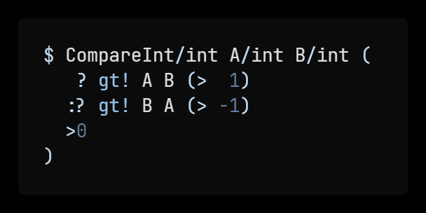

# skol-code

skol-code is a [VS Code][vsc] extension that provides basic syntax highlighting
for [skol][skol] code.

Here's what it looks like:

[vsc]: https://code.visualstudio.com
[skol]: https://github.com/syzkrash/skol
